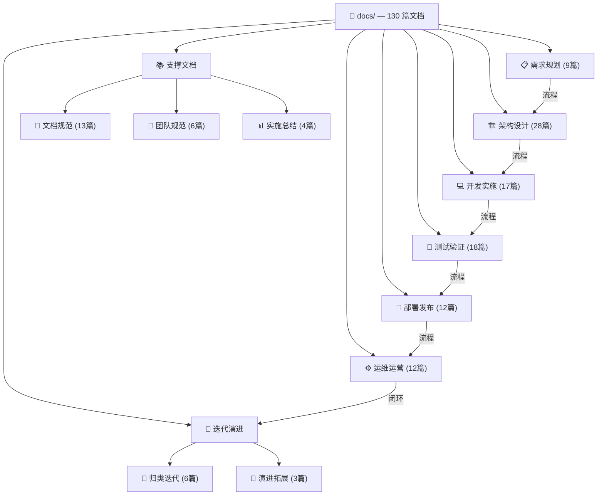

# YYC³ 文档库总索引

> ***YanYuCloudCube***
> *言启千行代码 丨 语枢万物智能*

---

| 属性 | 值 |
|------|-----|
| **项目** | YYC³ 企业智能管理系统 (YYC3-Management) |
| **文档总数** | 130 篇 |
| **最后更新** | 2026-07-17 |
| **维护团队** | YYC³ 技术委员会 <admin@0379.email> |
| **仓库地址** | [github.com/YYC-Cube/YYC3-Management](https://github.com/YYC-Cube/YYC3-Management) |

---

## 📋 目录

- [文档架构全景](#-文档架构全景)
- [按生命周期导航](#-按生命周期导航)
- [团队规范（必读）](#-团队规范必读)
- [需求规划](#-需求规划)
- [架构设计](#-架构设计)
- [开发实施](#-开发实施)
- [测试验证](#-测试验证)
- [部署发布](#-部署发布)
- [运维运营](#-运维运营)
- [实施总结](#-实施总结)
- [归类迭代](#-归类迭代)
- [演进拓展](#-演进拓展)
- [文档规范](#-文档规范)
- [按受众导航](#-按受众导航)

---

## 📐 文档架构全景

### 目录统计总览

| 目录 | 篇数 | 架构类 | 技巧类 | 其他 |
|------|------|--------|--------|------|
| 🏗️ YYC3-Menu-架构设计 | 28 | 22 | 4 | 2 |
| 🧪 YYC3-Menu-测试验证 | 18 | 5 | 6 | 7 |
| 💻 YYC3-Menu-开发实施 | 17 | 11 | 6 | — |
| 📖 YYC3-Menu-文档规范 | 13 | — | — | 13 |
| ⚙️ YYC3-Menu-运维运营 | 12 | 5 | 6 | 1 |
| 🚀 YYC3-Menu-部署发布 | 12 | 5 | 6 | 1 |
| 📋 YYC3-Menu-需求规划 | 9 | 6 | 3 | — |
| 👥 YYC3-Menu-团队规范 | 6 | — | — | 6 |
| 🔄 YYC3-Menu-归类迭代 | 6 | 3 | 3 | — |
| 📊 YYC3-Menu-实施总结 | 4 | — | — | 4 |
| 🔄 YYC3-Menu-演进拓展 | 3 | — | — | 3 |
| **合计** | **130** | **57** | **34** | **40** |

---

## 📑 按生命周期导航

以下按软件全生命周期顺序（需求 → 架构 → 开发 → 测试 → 部署 → 运维 → 迭代）组织文档导航。

---

## 👥 团队规范（必读）

> 定义团队核心机制、开发标准与全端适配规范，是所有开发者的必读文档。

| 文档 | 说明 |
|------|------|
| [YYC3-团队核心-五维驱动](./YYC3-Menu-团队规范/YYC3-团队核心-五维驱动.md) | 五高五标五化五维核心机制官方标准 |
| [YYC3-团队规范-开发标准](./YYC3-Menu-团队规范/YYC3-团队规范-开发标准.md) | 团队开发规范与代码标准 |
| [YYC3-团队规范-文档闭环](./YYC3-Menu-团队规范/YYC3-团队规范-文档闭环.md) | 文档全生命周期闭环管理 |
| [YYC3-团队通用-开发文档](./YYC3-Menu-团队规范/YYC3-团队通用-开发文档.md) | 团队通用开发指南 |
| [YYC3-多端适配-规范文档](./YYC3-Menu-团队规范/YYC3-多端适配-规范文档.md) | PC/平板/手机/PWA/小程序全端适配方案 |
| [YYC3-闭环验收-提示系统](./YYC3-Menu-团队规范/YYC3-闭环验收-提示系统.md) | 项目闭环验收提示系统 |

---

## 📋 需求规划

### 架构类（6篇）

| 文档 | 说明 |
|------|------|
| [01-智能化应用业务架构说明书](./YYC3-Menu-需求规划/架构类/01-YYC3-Menu-架构类-智能化应用业务架构说明书.md) | 业务架构总体设计 |
| [02-需求阶段架构可行性分析报告](./YYC3-Menu-需求规划/架构类/02-YYC3-Menu-架构类-需求阶段架构可行性分析报告.md) | 需求可行性分析 |
| [03-数据架构需求规划文档](./YYC3-Menu-需求规划/架构类/03-YYC3-Menu-架构类-数据架构需求规划文档.md) | 数据架构规划 |
| [04-智能化能力需求规格说明书](./YYC3-Menu-需求规划/架构类/04-YYC3-Menu-架构类-智能化能力需求规格说明书.md) | AI能力需求规格 |
| [快速开始指南](./YYC3-Menu-需求规划/架构类/YYC3-Menu-需求规划-快速开始指南.md) | 需求阶段快速入门 |
| [技术栈规划](./YYC3-Menu-需求规划/架构类/YYC3-Menu-需求规划-技术栈规划.md) | 技术选型规划 |

### 技巧类（3篇）

| 文档 | 说明 |
|------|------|
| [01-需求文档标准化编写指南](./YYC3-Menu-需求规划/技巧类/01-YYC3-Menu-技巧类-需求文档标准化编写指南.md) | 需求文档编写规范 |
| [02-跨部门需求协同沟通技巧手册](./YYC3-Menu-需求规划/技巧类/02-YYC3-Menu-技巧类-跨部门需求协同沟通技巧手册.md) | 跨部门协同技巧 |
| [03-智能化需求优先级排序方法](./YYC3-Menu-需求规划/技巧类/03-YYC3-Menu-技巧类-智能化需求优先级排序方法.md) | 需求优先级排序 |

---

## 🏗️ 架构设计

### 架构类（22篇）

| 文档 | 说明 |
|------|------|
| [01-总体架构设计文档](./YYC3-Menu-架构设计/架构类/01-YYC3-Menu-架构类-总体架构设计文档.md) | 系统总体架构设计 |
| [02-微服务架构设计文档](./YYC3-Menu-架构设计/架构类/02-YYC3-Menu-架构类-微服务架构设计文档.md) | 微服务拆分与设计 |
| [03-数据架构详细设计文档](./YYC3-Menu-架构设计/架构类/03-YYC3-Menu-架构类-数据架构详细设计文档.md) | 数据架构设计 |
| [04-接口架构设计文档](./YYC3-Menu-架构设计/架构类/04-YYC3-Menu-架构类-接口架构设计文档.md) | 接口架构设计 |
| [05-安全架构设计文档](./YYC3-Menu-架构设计/架构类/05-YYC3-Menu-架构类-安全架构设计文档.md) | 安全架构设计 |
| [06-智能架构设计文档](./YYC3-Menu-架构设计/架构类/06-YYC3-Menu-架构类-智能架构设计文档.md) | AI智能架构 |
| [07-部署架构设计文档](./YYC3-Menu-架构设计/架构类/07-YYC3-Menu-架构类-部署架构设计文档.md) | 部署架构设计 |
| [08-架构决策记录（ADR）集](./YYC3-Menu-架构设计/架构类/08-YYC3-Menu-架构类-架构决策记录（ADR）集.md) | 架构决策记录 |
| [系统架构概览](./YYC3-Menu-架构设计/架构类/YYC3-Menu-架构类-系统架构概览.md) | 系统架构快速概览 |
| [架构设计](./YYC3-Menu-架构设计/架构类/YYC3-Menu-架构类-架构设计.md) | 架构设计总论 |
| [AI分析引擎设计](./YYC3-Menu-架构设计/架构类/YYC3-Menu-架构类-AI分析引擎设计.md) | AI分析引擎架构 |
| [AI教练系统设计](./YYC3-Menu-架构设计/架构类/YYC3-Menu-架构类-AI教练系统设计.md) | AI教练系统 |
| [API安全实施方案](./YYC3-Menu-架构设计/架构类/YYC3-Menu-架构类-API安全实施方案.md) | API安全方案 |
| [安全中心设计](./YYC3-Menu-架构设计/架构类/YYC3-Menu-架构类-安全中心设计.md) | 安全中心架构 |
| [客户关系管理设计](./YYC3-Menu-架构设计/架构类/YYC3-Menu-架构类-客户关系管理设计.md) | CRM系统设计 |
| [工作流引擎设计](./YYC3-Menu-架构设计/架构类/YYC3-Menu-架构类-工作流引擎设计.md) | 工作流引擎 |
| [关键用户旅程](./YYC3-Menu-架构设计/架构类/YYC3-Menu-架构类-关键用户旅程.md) | 用户旅程地图 |
| [学习系统设计](./YYC3-Menu-架构设计/架构类/YYC3-Menu-架构类-学习系统设计.md) | 学习系统架构 |
| [智枢服务化平台规划AI](./YYC3-Menu-架构设计/架构类/YYC3-Menu-架构类-智枢服务化平台规划AI.md) | 智枢平台规划 |
| [智能呼叫系统设计](./YYC3-Menu-架构设计/架构类/YYC3-Menu-架构类-智能呼叫系统设计.md) | 智能呼叫系统 |
| [自主AI浮窗设计](./YYC3-Menu-架构设计/架构类/YYC3-Menu-架构类-自主AI浮窗设计.md) | AI浮窗组件设计 |
| [营销自动化设计](./YYC3-Menu-架构设计/架构类/YYC3-Menu-架构类-营销自动化设计.md) | 营销自动化 |

### 技巧类（4篇）

| 文档 | 说明 |
|------|------|
| [01-架构设计绘图规范与工具指南](./YYC3-Menu-架构设计/技巧类/01-YYC3-Menu-技巧类-架构设计绘图规范与工具指南.md) | 架构图绘制规范 |
| [02-微服务拆分避坑指南](./YYC3-Menu-架构设计/技巧类/02-YYC3-Menu-技巧类-微服务拆分避坑指南.md) | 微服务拆分经验 |
| [03-AI架构集成性能优化技巧](./YYC3-Menu-架构设计/技巧类/03-YYC3-Menu-技巧类-AI架构集成性能优化技巧.md) | AI集成性能优化 |
| [04-架构评审Checklist](./YYC3-Menu-架构设计/技巧类/04-YYC3-Menu-技巧类-架构评审%20Checklist.md) | 架构评审清单 |

### 其他（2篇）

| 文档 | 说明 |
|------|------|
| [闭环系统设计](./YYC3-Menu-架构设计/架构类/YYC3-Menu-架构类-闭环系统设计.md) | 闭环系统架构 |
| [AI浮窗增强架构方案](./YYC3-Menu-架构设计/架构类/YYC3-Menu-架构设计-AI浮窗增强架构方案.md) | AI浮窗增强方案 |

---

## 💻 开发实施

### 架构类（11篇）

| 文档 | 说明 |
|------|------|
| [01-代码架构实现说明书](./YYC3-Menu-开发实施/架构类/01-YYC3-Menu-架构类-代码架构实现说明书.md) | 代码架构实现 |
| [02-API接口实现文档](./YYC3-Menu-开发实施/架构类/02-YYC3-Menu-架构类-API接口实现文档.md) | API接口实现 |
| [03-数据访问层架构实现文档](./YYC3-Menu-开发实施/架构类/03-YYC3-Menu-架构类-数据访问层架构实现文档.md) | DAL层实现 |
| [04-中间件集成架构文档](./YYC3-Menu-开发实施/架构类/04-YYC3-Menu-架构类-中间件集成架构文档.md) | 中间件集成 |
| [05-AI模型开发与集成文档](./YYC3-Menu-开发实施/架构类/05-YYC3-Menu-架构类-AI模型开发与集成文档.md) | AI模型集成 |
| [API接口文档](./YYC3-Menu-开发实施/架构类/YYC3-Menu-架构类-API接口文档.md) | REST API完整文档 |
| [API文档](./YYC3-Menu-开发实施/架构类/YYC3-Menu-架构类-API文档.md) | API参考手册 |
| [API设计标准](./YYC3-Menu-开发实施/架构类/YYC3-Menu-开发规范-API设计标准.md) | API设计规范 |
| [组件开发指南](./YYC3-Menu-开发实施/架构类/YYC3-Menu-开发规范-组件开发指南.md) | 组件开发规范 |
| [API接口文档（规范）](./YYC3-Menu-开发实施/架构类/YYC3-Menu-开发规范-API接口文档.md) | API接口规范文档 |
| [SystemSettings组件拆分方案](./YYC3-Menu-开发实施/架构类/YYC3-Menu-架构类-SystemSettings组件拆分方案.md) | 组件拆分方案 |

### 技巧类（6篇）

| 文档 | 说明 |
|------|------|
| [01-编码规范手册](./YYC3-Menu-开发实施/技巧类/01-YYC3-Menu-技巧类-编码规范手册.md) | 编码规范 |
| [02-版本控制最佳实践](./YYC3-Menu-开发实施/技巧类/02-YYC3-Menu-技巧类-版本控制最佳实践.md) | Git最佳实践 |
| [03-开发效率提升技巧集](./YYC3-Menu-开发实施/技巧类/03-YYC3-Menu-技巧类-开发效率提升技巧集.md) | 效率提升技巧 |
| [04-常见开发架构问题解决方案](./YYC3-Menu-开发实施/技巧类/04-YYC3-Menu-技巧类-常见开发架构问题解决方案.md) | 常见问题解决 |
| [05-AI模型开发调优技巧](./YYC3-Menu-开发实施/技巧类/05-YYC3-Menu-技巧类-AI模型开发调优技巧.md) | AI模型调优 |
| [TypeScript规范](./YYC3-Menu-开发实施/技巧类/YYC3-Menu-技巧类-TypeScript规范.md) | TS编码规范 |

---

## 🧪 测试验证

### 架构类（5篇）

| 文档 | 说明 |
|------|------|
| [01-测试架构设计文档](./YYC3-Menu-测试验证/架构类/01-YYC3-Menu-架构类-测试架构设计文档.md) | 测试架构设计 |
| [02-性能测试架构文档](./YYC3-Menu-测试验证/架构类/02-YYC3-Menu-架构类-性能测试架构文档.md) | 性能测试架构 |
| [03-安全测试架构文档](./YYC3-Menu-测试验证/架构类/03-YYC3-Menu-架构类-安全测试架构文档.md) | 安全测试架构 |
| [04-AI专项测试架构文档](./YYC3-Menu-测试验证/架构类/04-YYC3-Menu-架构类-AI专项测试架构文档.md) | AI专项测试 |
| [测试策略](./YYC3-Menu-测试验证/架构类/YYC3-Menu-架构类-测试策略.md) | 测试策略总论 |

### 技巧类（6篇）

| 文档 | 说明 |
|------|------|
| [01-测试用例设计技巧手册](./YYC3-Menu-测试验证/技巧类/01-YYC3-Menu-技巧类-测试用例设计技巧手册.md) | 用例设计技巧 |
| [02-自动化测试脚本编写指南](./YYC3-Menu-测试验证/技巧类/02-YYC3-Menu-技巧类-自动化测试脚本编写指南.md) | 自动化脚本指南 |
| [03-性能测试调优技巧](./YYC3-Menu-测试验证/技巧类/03-YYC3-Menu-技巧类-性能测试调优技巧.md) | 性能调优技巧 |
| [04-测试缺陷管理规范与技巧](./YYC3-Menu-测试验证/技巧类/04-YYC3-Menu-技巧类-测试缺陷管理规范与技巧.md) | 缺陷管理 |
| [05-AI测试数据准备与标注技巧](./YYC3-Menu-测试验证/技巧类/05-YYC3-Menu-技巧类-AI测试数据准备与标注技巧.md) | AI测试数据 |
| [测试编写规范](./YYC3-Menu-测试验证/技巧类/YYC3-Menu-技巧类-测试编写规范.md) | 测试编写规范 |

### 测试报告（7篇）

| 文档 | 说明 |
|------|------|
| [EPIPE错误修复报告](./YYC3-Menu-测试验证/YYC3-Menu-测试验证-EPIPE错误修复报告.md) | EPIPE错误修复 |
| [交互功能测试报告](./YYC3-Menu-测试验证/YYC3-Menu-测试验证-交互功能测试报告.md) | 交互功能测试 |
| [功能页面完整度测试报告](./YYC3-Menu-测试验证/YYC3-Menu-测试验证-功能页面完整度测试报告.md) | 页面完整度测试 |
| [场景完整性有效性标准](./YYC3-Menu-测试验证/YYC3-Menu-测试验证-场景完整性有效性标准.md) | 场景验证标准 |
| [按钮交互功能测试总结](./YYC3-Menu-测试验证/YYC3-Menu-测试验证-按钮交互功能测试总结.md) | 按钮交互测试 |
| [测试执行总结](./YYC3-Menu-测试验证/YYC3-Menu-测试验证-测试执行总结.md) | 测试执行总结 |
| [测试框架建立验证报告](./YYC3-Menu-测试验证/YYC3-Menu-测试验证-测试框架建立验证报告.md) | 框架验证报告 |

---

## 🚀 部署发布

### 架构类（5篇）

| 文档 | 说明 |
|------|------|
| [01-部署架构实施文档](./YYC3-Menu-部署发布/架构类/01-YYC3-Menu-架构类-部署架构实施文档.md) | 部署架构实施 |
| [02-CI/CD流水线架构文档](./YYC3-Menu-部署发布/架构类/02-YYC3-Menu-架构类-CI_CD流水线架构文档.md) | CI/CD架构 |
| [03-多环境部署架构差异文档](./YYC3-Menu-部署发布/架构类/03-YYC3-Menu-架构类-多环境部署架构差异文档.md) | 多环境差异 |
| [04-灰度发布架构设计文档](./YYC3-Menu-部署发布/架构类/04-YYC3-Menu-架构类-灰度发布架构设计文档.md) | 灰度发布设计 |
| [CICD部署文档](./YYC3-Menu-部署发布/架构类/YYC3-Menu-架构类-CICD部署文档.md) | CICD部署流程 |

### 技巧类（6篇）

| 文档 | 说明 |
|------|------|
| [01-Docker容器化部署技巧](./YYC3-Menu-部署发布/技巧类/01-YYC3-Menu-技巧类-Docker容器化部署技巧.md) | Docker部署 |
| [02-K8s部署运维技巧](./YYC3-Menu-部署发布/技巧类/02-YYC3-Menu-技巧类-K8s部署运维技巧.md) | K8s运维 |
| [03-CI/CD流水线搭建与优化技巧](./YYC3-Menu-部署发布/技巧类/03-YYC3-Menu-技巧类-CI_CD流水线搭建与优化技巧.md) | CI/CD搭建 |
| [04-部署问题排查指南](./YYC3-Menu-部署发布/技巧类/04-YYC3-Menu-技巧类-部署问题排查指南.md) | 部署排障 |
| [05-灰度发布风险控制技巧](./YYC3-Menu-部署发布/技巧类/05-YYC3-Menu-技巧类-灰度发布风险控制技巧.md) | 灰度风险控制 |
| [Docker部署](./YYC3-Menu-部署发布/技巧类/YYC3-Menu-技巧类-Docker部署.md) | Docker部署速查 |

### 其他（1篇）

| 文档 | 说明 |
|------|------|
| [开发环境配置](./YYC3-Menu-部署发布/技巧类/YYC3-Menu-技巧类-开发环境配置.md) | 本地开发环境 |

---

## ⚙️ 运维运营

### 架构类（5篇）

| 文档 | 说明 |
|------|------|
| [01-运维架构设计文档](./YYC3-Menu-运维运营/架构类/01-YYC3-Menu-架构类-运维架构设计文档.md) | 运维架构设计 |
| [02-智能运维架构文档](./YYC3-Menu-运维运营/架构类/02-YYC3-Menu-架构类-智能运维架构文档.md) | 智能运维架构 |
| [03-灾备架构运维文档](./YYC3-Menu-运维运营/架构类/03-YYC3-Menu-架构类-灾备架构运维文档.md) | 灾备架构 |
| [04-系统扩容架构文档](./YYC3-Menu-运维运营/架构类/04-YYC3-Menu-架构类-系统扩容架构文档.md) | 系统扩容 |
| [部署运维-完整部署指南](./YYC3-Menu-运维运营/架构类/YYC3-Menu-部署运维-完整部署指南.md) | 完整部署指南 |

### 技巧类（6篇）

| 文档 | 说明 |
|------|------|
| [01-运维手册](./YYC3-Menu-运维运营/技巧类/01-YYC3-Menu-技巧类-运维手册.md) | 运维操作手册 |
| [02-监控告警配置技巧](./YYC3-Menu-运维运营/技巧类/02-YYC3-Menu-技巧类-监控告警配置技巧.md) | 监控告警配置 |
| [03-日志分析与问题定位技巧](./YYC3-Menu-运维运营/技巧类/03-YYC3-Menu-技巧类-日志分析与问题定位技巧.md) | 日志分析 |
| [04-智能运维平台操作指南](./YYC3-Menu-运维运营/技巧类/04-YYC3-Menu-技巧类-智能运维平台操作指南.md) | 智能运维操作 |
| [05-灾备演练与恢复技巧](./YYC3-Menu-运维运营/技巧类/05-YYC3-Menu-技巧类-灾备演练与恢复技巧.md) | 灾备演练 |
| [06-系统性能优化运维技巧](./YYC3-Menu-运维运营/技巧类/06-YYC3-Menu-技巧类-系统性能优化运维技巧.md) | 性能优化运维 |

### 其他（1篇）

| 文档 | 说明 |
|------|------|
| [部署运维-快速参考手册](./YYC3-Menu-运维运营/架构类/YYC3-Menu-部署运维-快速参考手册.md) | 运维快速参考 |

---

## 📊 实施总结

| 文档 | 说明 |
|------|------|
| [实施总结README](./YYC3-Menu-实施总结/README.md) | 实施总结索引 |
| [全局闭环最终报告](./YYC3-Menu-实施总结/YYC3-Menu-实施总结-全局闭环最终报告.md) | 全局闭环总结 |
| [最终实施报告](./YYC3-Menu-实施总结/YYC3-Menu-实施总结-最终实施报告.md) | 最终实施报告 |
| [深度架构完成报告-Phase3](./YYC3-Menu-实施总结/YYC3-Menu-实施总结-深度架构完成报告-Phase3.md) | Phase3架构完成 |

---

## 🔄 归类迭代

### 架构类（3篇）

| 文档 | 说明 |
|------|------|
| [01-项目文档归档架构说明](./YYC3-Menu-归类迭代/架构类/01-YYC3-Menu-架构类-项目文档归档架构说明.md) | 文档归档架构 |
| [02-系统迭代架构规划文档](./YYC3-Menu-归类迭代/架构类/02-YYC3-Menu-架构类-系统迭代架构规划文档.md) | 迭代规划 |
| [03-架构资产沉淀文档](./YYC3-Menu-归类迭代/架构类/03-YYC3-Menu-架构类-架构资产沉淀文档.md) | 资产沉淀 |

### 技巧类（3篇）

| 文档 | 说明 |
|------|------|
| [01-文档归档规范与技巧](./YYC3-Menu-归类迭代/技巧类/01-YYC3-Menu-技巧类-文档归档规范与技巧.md) | 归档规范 |
| [02-架构评审与迭代规划技巧](./YYC3-Menu-归类迭代/技巧类/02-YYC3-Menu-技巧类-架构评审与迭代规划技巧.md) | 评审规划技巧 |
| [03-知识复用与沉淀技巧](./YYC3-Menu-归类迭代/技巧类/03-YYC3-Menu-技巧类-知识复用与沉淀技巧.md) | 知识沉淀 |

---

## 🔮 演进拓展

| 文档 | 说明 |
|------|------|
| [MVP功能拓展方案](./YYC3-Menu-演进拓展/YYC3-MVP功能拓展方案.md) | MVP拓展规划 |
| [功能拓展实施计划](./YYC3-Menu-演进拓展/YYC3-功能拓展实施计划.md) | 拓展实施计划 |
| [功能拓展规划报告](./YYC3-Menu-演进拓展/YYC3-功能拓展规划报告.md) | 拓展规划报告 |

---

## 📖 文档规范

### 规范文档（10篇）

| 文档 | 说明 |
|------|------|
| [文档规范README](./YYC3-Menu-文档规范/README.md) | 文档规范索引 |
| [项目全量文档架构](./YYC3-Menu-文档规范/YYC3-Menu-项目全量文档架构.md) | 全量文档架构说明 |
| [团队标准化规范](./YYC3-Menu-文档规范/YYC3-Menu-文档规范-团队标准化规范.md) | 团队标准化 |
| [安全策略](./YYC3-Menu-文档规范/YYC3-Menu-文档规范-安全策略.md) | 安全策略规范 |
| [UI增强实施方案](./YYC3-Menu-文档规范/YYC3-Menu-文档规范-UI增强实施方案.md) | UI增强方案 |
| [文档架构整理报告](./YYC3-Menu-文档规范/YYC3-Menu-文档规范-文档架构整理报告.md) | 架构整理报告 |
| [智枢服务化平台规划AI](./YYC3-Menu-文档规范/YYC3-Menu-文档规范-智枢服务化平台规划AI.md) | 智枢平台规划 |
| [术语表](./YYC3-Menu-文档规范/YYC3-Menu-文档规范-术语表.md) | 专业术语表 |
| [文档全生命周期管理架构](./YYC3-Menu-文档规范/YYC3-文档全生命周期管理架构.md) | 文档生命周期 |

### 文档模板（4篇）

| 文档 | 说明 |
|------|------|
| [分析建议文档模版](./YYC3-Menu-文档规范/YYC3-分析建议文档模版.md) | 分析建议模板 |
| [实施总结文档模版](./YYC3-Menu-文档规范/YYC3-实施总结文档模版.md) | 实施总结模板 |
| [技术评审文档模版](./YYC3-Menu-文档规范/YYC3-技术评审文档模版.md) | 技术评审模板 |
| [项目验收文档模版](./YYC3-Menu-文档规范/YYC3-项目验收文档模版.md) | 项目验收模板 |

---

## 🎯 按受众导航

| 受众 | 推荐阅读路径 |
|------|-------------|
| **👨‍💼 产品经理** | 五维驱动 → 业务架构说明书 → 关键用户旅程 → 智能化能力需求规格 |
| **👨‍💻 开发者** | 团队开发标准 → 代码架构实现 → API接口文档 → 组件开发指南 → AGENTS.md |
| **🏗️ 架构师** | 总体架构设计 → 微服务架构 → 安全架构 → ADR集 → 架构评审Checklist |
| **🧪 测试工程师** | 测试策略 → 测试架构设计 → 用例设计技巧 → 自动化脚本指南 |
| **👨‍🔧 运维人员** | 部署架构实施 → 运维手册 → 监控告警配置 → 灾备演练 → OPERATIONS.md |
| **📦 部署工程师** | CICD部署文档 → Docker部署技巧 → K8s运维 → 多环境差异 → 灰度发布 |

---

## 🔗 快速链接

| 链接 | 说明 |
|------|------|
| [项目 README](../README.md) | 项目主页 |
| [AGENTS.md](../AGENTS.md) | AI Agent 开发指南 |
| [SECURITY.md](../SECURITY.md) | 安全策略 |
| [OPERATIONS.md](./OPERATIONS.md) | 运维操作手册 |

---

  ® YYC³（YanYuCloudCube）言语云立方 — 言启千行代码，语枢万物智能 
  📧 admin@0379.email 丨 维护团队: YYC³ 技术委员会

